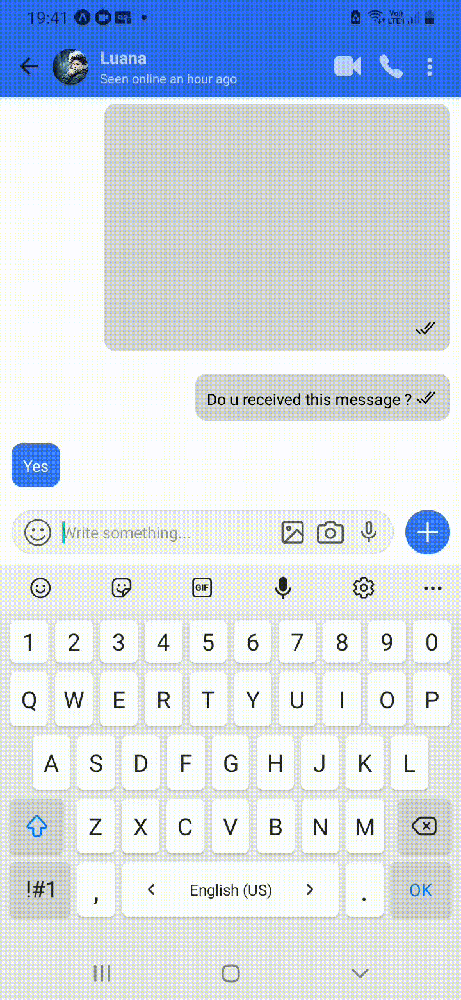
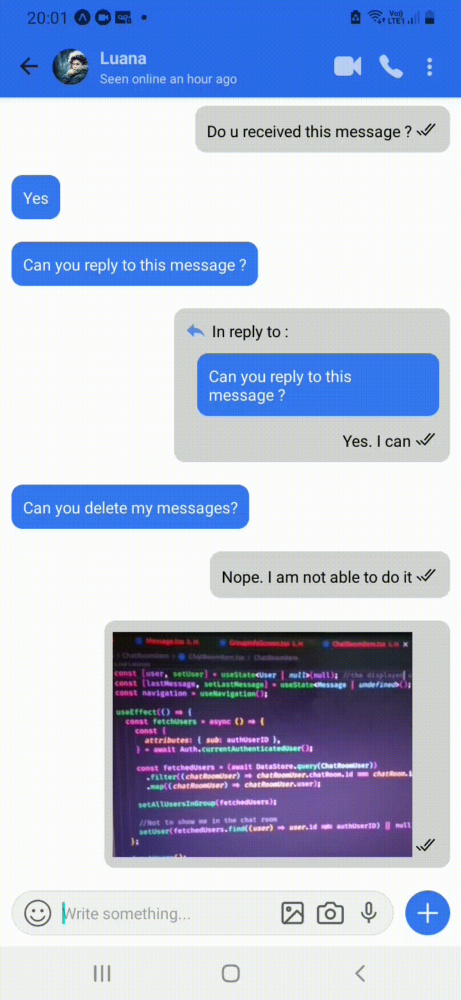

<h1 align="center">
   
</h1>

 
<h1 align="center">
   
</h1>

# Sigma

Application with the purpose of sending messages on secure way to our friends

Sigma app inspired by Signal Ui made in React Native and AWS Amplify.

Developed with <code>React Native</code>, <code>Aws Amplify</code>,<code>Expo Vector Icons</code>, <code>Cognito</code>,
<code>expo-av</code> ,<code> expo-image-picker</code>  
and <code>TweetNaCl</code> 
 

## A little about how the project works:

Functionalities:
- Send messages, images (Gallery or Camera), audios.
- User Online/Offline status and last seen.
- SENT/READ/DELIVERED message status
- create Groups and remove users
- Delete messages
- Message Replies

## User Authentication with Cognito

   
For user authentication, cognito Service was used.It keep track all users, tokens, permissions etc.
 However,the users from the app contain photos and names. Just Authentication is not enough for that. It is necessary to keep them in the database, but how to save user data as soon as he registers in the app? For this, `Amplify Authentication Module`  can trigger some actions, among them the `User Confirmation`.That is, as soon as the user confirms the email, something can be done.
    Behind these triggers are the `Lambda functions`, which run in the cloud on AWS  without having to worry about servers. As said, you have Authentication Module that can trigger functions depending on some events.
   In this case `User Confirmation Event` serves the purpose, because when the user confirms, a lambda is created that will `save the user data in DynamoDB`, with this we can show user data on screen. For this, it was necessary to make some settings. On the terminal i typed `amplify auth update` and follow a few steps until the last question where it shows the option `which trigger do you want to enable for cognito` just choose `Post Confirmation` and then choose to add the lambda function with the purpose of save user data in DynanoDB.

## Upload of images

Briefly, The first step is all about permissions. Ensure that the application has access to the user's images. Next step, was to picker the image from device and as a return we have the local (Mobile) URI of the image, setting it to state.  To save the image in the cloud i have used S3 Storage.

## SENT, READ and DELIVERED Message Status 

To implement this feature, the following logic was thought:  
When a message is sent whether it is delivered or not we have to check if the  
message has been successfully synced to the cloud, if the message has been saved
in the database. 

Because if we don't have internet the message will appear on the screen because we are 
using DataStore but will not be synchronized with database. So in this case it shouldn't show any `checkmark`,  once the message is successfully synced
the status should change to `DELIVERED` and when the message is read to `READ`.
To check if the message is saved in the database, we can listen some events. 
DataStore events will trigger some events, we have the `outboxMutationEnqueued` dispatched when local changes have recently been prepared for synchronization. In this way, as soon as we are trying to send something for synchronization with the cloud, the mentioned event will be triggered and when it is finished the `outboxMutationProcessed` event is triggered.

That is, listening to the outboxMutationProcessed event it is possible to change the message state from "SENT" to "DELIVERED" since we have this event as soon as a message is synchronized and saved in the database. The listener was added to the APP function, as we know that this component will always be mounted. Basically, in the app component, inside the listener function we `check if the event is equal` to `outboxMutationProcessed`, if so, we check if the "model" returned by the function is equal to the Message Model of our application.

`Finally`, we just set the message to `DELIVERED`. To view the status change in real time, we use DataStore.observe to notice changes in the Model Message opType and set the message's new state. To set the status as "READ", it is enough to check if the message is not mine and if the message does not already contain "READ" status, if ok in this verification, a copy is made in the DataStore using the new state of the message specifying which status(Message).

 
## :camera: See the app's features till now:

<h2>DELIVERED status is set when the user views the message</h2>

<h1>
   
</h1>

<h2>Reply to a message</h2>

<h1>
   
</h1>

<h2>Delete Message</h2>

<h1>
   
</h1>

<h2>Trying to delete another user's message</h2>

<h1>
   
</h1>

<h2>Groups and remove some users</h2>

<h1>
   
</h1>

<h2>Send Images</h2>

<h1>
   
</h1>

<h2>Take photos and send them</h2>

<h1>
   
</h1>

 

## Getting started

1. Clone this repo using `git@github.com:eulazzo/sigma_app.git`
2. Move yourself to the appropriate directory: `cd sigma-app` 
3. Run `npm install` to install dependencies 

## :rocket: Technologies

<table>
   
  <thead>
    <th>Back-end</th>
    <th>Front-end</th>
  </thead>
   
  <tbody>
    <tr>
      <td>Aws Amplify</td>
      <td>React Native</td>
    </tr>
     <tr>
      <td>Cognito</td>
      <td>Css</td>
    </tr>
  </tbody>
  
</table>

## License

This project is licensed under the MIT License - see the [LICENSE](https://opensource.org/licenses/MIT) page for details.
<!-- <h4>Techs:</h4>

  

  -->

 

